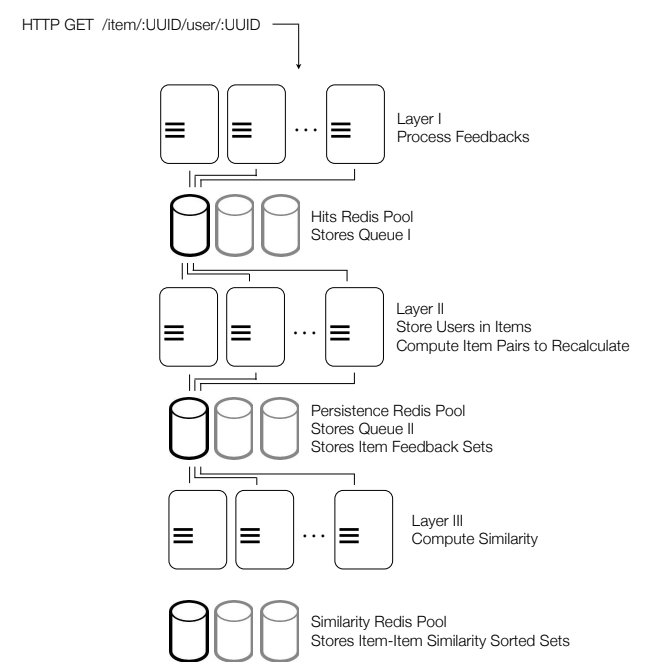

# Real-time collaborative filtering (Proof of concept)
```
Research only - Do not use in production
```

This is an attempt to implement Real Time collaborative filtering based on the following research paper:
https://www.sciencedirect.com/science/article/pii/S0166361513002352


__Highlights__

• Proposal of a new general architecture for a real-time collaborative filtering system that produces item–item recommendations.

• The proposed architecture makes use of all available input data, as opposed to data sampling, to produce relevant recommendations.

• It also makes use of on-demand computing resources (cloud computing) to scale up and down, and adapt to variations in the number of items as well as users.

• Shows a real industry application of the architecture.


## Data storage
Analyzing the architecture described above, there are still
some critical points related to scalability. One is the data
repository or storage of item sets, since the greater the
number of items and amount of feedback are, the greater is
the amount of data required to represent them. Another
critical issue related to data access is the time required to
read and write information, which can lead to request
queuing as the number of nodes in the system increases. A
third area of attention is the queues used to connect the
different layers, which may limit the number of reads and
writes, and cannot scale as the number of operations per
second increases, for example, when there is a burst of user
feedback.
To address problems related to the data repository, the
proposed architecture uses a distributed in-memory
representation, which isolates read operations from write
operations.



<sup>[1](#cfProcess)</sup> Multi-Layer collaborative filtering process 

<sup>[2](#cfMovielensDataset)</sup> Movie lens dataset files in __data__ directory

<hr />
<a name="cf-process">1</a>: https://www.sciencedirect.com/science/article/pii/S0166361513002352


<a name="cf-movielens-dataset">2</a>: F. Maxwell Harper and Joseph A. Konstan. 2015. The MovieLens Datasets:
History and Context. ACM Transactions on Interactive Intelligent
Systems (TiiS) 5, 4, Article 19 (December 2015), 19 pages.
DOI=http://dx.doi.org/10.1145/2827872