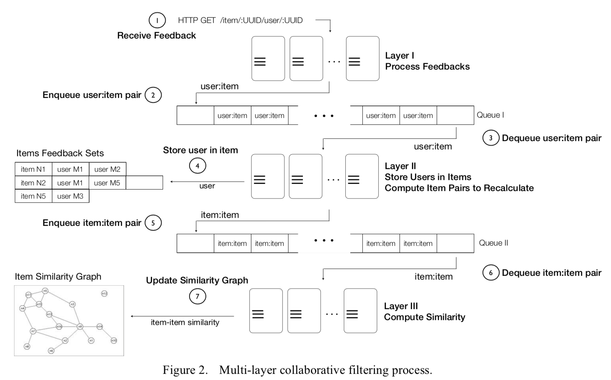

# Real-time collaborative filtering (Proof of concept)
```
Research only - Do not use in production
```

This is an attempt to implement Real Time collaborative filtering based on the following research paper:
https://www.sciencedirect.com/science/article/pii/S0166361513002352


__Highlights__

• Proposal of a new general architecture for a real-time collaborative filtering system that produces item–item recommendations.

• The proposed architecture makes use of all available input data, as opposed to data sampling, to produce relevant recommendations.

• It also makes use of on-demand computing resources (cloud computing) to scale up and down, and adapt to variations in the number of items as well as users.

• Shows a real industry application of the architecture.




<sup>[1](#cfProcess)</sup> Multi-Layer collaborative filtering process 
<hr />
<a name="cf-process">1</a>: https://www.sciencedirect.com/science/article/pii/S0166361513002352